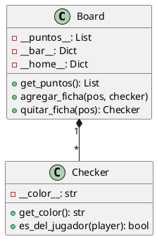

# Prompts de Documentación - Backgammon

Este documento registra todas las consultas realizadas sobre documentación, convenciones y buenas prácticas durante el desarrollo del proyecto.

---

## 1. Definición Args

**Pregunta**: ¿Qué es args?

**Respuesta**: Args es una abreviación de "Arguments" (argumentos). Es una convención en la documentación de Python para describir los parámetros que recibe una función o método en los docstrings.

**Ejemplo de uso en docstrings**:
```python
def hacer_movimiento(self, desde, hasta):
    """
    Realiza un movimiento de una ficha en el tablero.
    
    Args:
        desde (int): Posición de origen (0-24)
        hasta (int): Posición de destino (1-25)
    
    Returns:
        bool: True si el movimiento fue exitoso
    
    Raises:
        ValueError: Si el movimiento es inválido
    """
    pass
```

---

## 2. Convención de Nombres de Atributos

**Pregunta**: ¿Por qué usar doble guión bajo (`__atributo__`) en los atributos?

**Respuesta**: El doble guión bajo antes y después del nombre de un atributo es una convención del proyecto específica. En Python estándar:

- `atributo`: público
- `_atributo`: protegido (convención, no forzado)
- `__atributo`: privado (name mangling)
- `__atributo__`: métodos mágicos/especiales

En este proyecto se usa `__atributo__` para todos los atributos privados como requisito de estilo.

---

## 3. Estructura de Docstrings

**Pregunta**: ¿Cómo estructurar correctamente los docstrings en Python?

**Respuesta**: Se utiliza el formato Google Style para docstrings:

```python
def metodo(self, param1, param2):
    """
    Descripción breve de una línea.
    
    Descripción más detallada que puede ocupar
    múltiples líneas si es necesario.
    
    Args:
        param1 (tipo): Descripción del parámetro 1
        param2 (tipo): Descripción del parámetro 2
    
    Returns:
        tipo: Descripción de lo que retorna
    
    Raises:
        ExceptionType: Cuándo se lanza esta excepción
    
    Example:
        >>> obj.metodo(valor1, valor2)
        resultado_esperado
    """
    pass
```

---

## 4. Comentarios vs Docstrings

**Pregunta**: ¿Cuándo usar comentarios y cuándo docstrings?

**Respuesta**:

**Docstrings**: Para documentar módulos, clases, métodos y funciones
```python
class Board:
    """
    Representa el tablero de backgammon con 24 puntos.
    
    Gestiona las posiciones de las fichas y valida movimientos
    según las reglas del juego.
    """
    pass
```

**Comentarios**: Para explicar código complejo dentro de métodos
```python
def calcular_movimiento(self, desde, hasta):
    # Calcular distancia considerando dirección del jugador
    if self.__color__ == 'white':
        distancia = hasta - desde  # Blancas mueven hacia arriba
    else:
        distancia = desde - hasta  # Negras mueven hacia abajo
```

---

## 5. Documentación de Excepciones

**Pregunta**: ¿Cómo documentar correctamente las excepciones que puede lanzar un método?

**Respuesta**:

```python
def hacer_movimiento(self, desde, hasta):
    """
    Ejecuta un movimiento en el tablero.
    
    Args:
        desde (int): Posición origen (1-24)
        hasta (int): Posición destino (1-25)
    
    Raises:
        ValueError: Si las posiciones están fuera de rango
        InvalidMoveError: Si el movimiento viola las reglas
        NoCheckerError: Si no hay ficha en la posición origen
    """
    if not 1 <= desde <= 24:
        raise ValueError("Posición origen inválida")
    
    if not self.tiene_fichas(desde):
        raise NoCheckerError("No hay ficha en esa posición")
```

---

## 6. CHANGELOG.md

**Pregunta**: ¿Qué formato usar para el CHANGELOG.md?

**Respuesta**: Se utiliza el formato de [Keep a Changelog](https://keepachangelog.com/):

```markdown
# Changelog

## [Unreleased]
### Agregado
- Nueva funcionalidad X

### Modificado
- Cambio en funcionalidad Y

### Corregido
- Bug en funcionalidad Z

### Eliminado
- Código deprecated W

## [1.0.0] - 2025-01-15
### Agregado
- Primera versión estable
```

**Categorías principales**:
- `Agregado`: Nuevas características
- `Modificado`: Cambios en funcionalidad existente
- `Corregido`: Bug fixes
- `Eliminado`: Código removido
- `Deprecated`: Funcionalidad que será removida
- `Seguridad`: Cambios de seguridad

---

## 7. README.md

**Pregunta**: ¿Qué secciones debe incluir un README.md completo?

**Respuesta**:

```markdown
# Nombre del Proyecto

Descripción breve del proyecto

## Características

- Lista de características principales

## Requisitos

- Python 3.8+
- pygame 2.0+

## Instalación

```bash
pip install -r requirements.txt
```

## Uso

```bash
python main.py
```

## Estructura del Proyecto

```
proyecto/
├── core/          # Lógica del juego
├── cli/           # Interfaz CLI
├── pygame_ui/     # Interfaz gráfica
└── tests/         # Tests unitarios
```

## Tests

```bash
python -m unittest discover tests
```

## Contribuir

Descripción de cómo contribuir

## Licencia

Tipo de licencia
```

---

## 8. Versionado Semántico

**Pregunta**: ¿Cómo versionar el proyecto correctamente?

**Respuesta**: Se usa [Semantic Versioning](https://semver.org/) (MAJOR.MINOR.PATCH):

- **MAJOR**: Cambios incompatibles con versiones anteriores
  - Ejemplo: `1.0.0` → `2.0.0`
  
- **MINOR**: Nueva funcionalidad compatible hacia atrás
  - Ejemplo: `1.0.0` → `1.1.0`
  
- **PATCH**: Bug fixes compatibles
  - Ejemplo: `1.0.0` → `1.0.1`

**Ejemplos**:
```
0.1.0 - Primera versión con Board
0.2.0 - Agregado Dice
0.3.0 - Agregado Player
1.0.0 - Primera versión completa y funcional
1.1.0 - Agregada interfaz Pygame
1.1.1 - Corregido bug en validación de movimientos
2.0.0 - Refactorización completa de la arquitectura
```

---

## 9. Documentación de Tests

**Pregunta**: ¿Cómo documentar los tests para que sean comprensibles?

**Respuesta**:

```python
class TestBoard(unittest.TestCase):
    """Tests para la clase Board del juego de backgammon."""
    
    def test_inicializacion_correcta(self):
        """
        Verifica que el tablero se inicialice con 24 posiciones
        y la configuración inicial estándar de backgammon.
        """
        board = Board()
        self.assertEqual(len(board.get_puntos()), 24)
        # ... más assertions
    
    def test_movimiento_invalido_lanza_excepcion(self):
        """
        Verifica que se lance ValueError cuando se intenta
        un movimiento a una posición fuera de rango.
        """
        board = Board()
        with self.assertRaises(ValueError):
            board.get_punto(25)
```

**Principios**:
- Nombre descriptivo del test
- Docstring explicando qué se prueba
- Comentarios para casos complejos
- Un test = una funcionalidad

---

## 10. Type Hints

**Pregunta**: ¿Debemos usar type hints en Python?

**Respuesta**: Los type hints mejoran la legibilidad y permiten detectar errores:

```python
from typing import List, Optional, Tuple

class Board:
    def __init__(self) -> None:
        self.__puntos__: List[Optional[List[Checker]]] = [[] for _ in range(24)]
    
    def get_punto(self, posicion: int) -> List[Checker]:
        """
        Obtiene las fichas en una posición específica.
        
        Args:
            posicion: Número del punto (1-24)
        
        Returns:
            Lista de fichas en esa posición
        """
        return self.__puntos__[posicion - 1]
    
    def get_color_punto(self, posicion: int) -> Optional[str]:
        """
        Obtiene el color de las fichas en un punto.
        
        Args:
            posicion: Número del punto (1-24)
        
        Returns:
            'white', 'black' o None si está vacío
        """
        punto = self.get_punto(posicion)
        return punto[0].get_color() if punto else None
```

**Ventajas**:
- Autocompletado en IDEs
- Detección temprana de errores
- Documentación implícita
- Mejor mantenibilidad

---

## 11. Diagramas UML

**Pregunta**: ¿Cómo documentar la arquitectura con diagramas UML?

**Respuesta**: Se usa PlantUML para generar diagramas desde texto:



**Herramientas recomendadas**:
- PlantUML para diagramas de clases
- Mermaid para diagramas de flujo
- Draw.io para diagramas más complejos

---

## 12. Justificación de Diseño

**Pregunta**: ¿Cómo documentar las decisiones de diseño del proyecto?

**Respuesta**: Se crea un archivo `JUSTIFICACION.md` que incluye:

1. **Resumen del diseño general**
2. **Justificación de cada clase**
   - Por qué existe
   - Qué responsabilidades tiene
   - Alternativas consideradas
3. **Justificación de atributos**
   - Por qué se eligió cada tipo de dato
   - Alternativas descartadas
4. **Decisiones arquitectónicas**
   - Por qué separar core de UI
   - Por qué usar ciertas estructuras de datos
5. **Cumplimiento de principios SOLID**
6. **Patrones de diseño aplicados**

**Ejemplo de sección**:
```markdown
### 4.2. Estructura de Datos del Tablero

**Decisión**: Usar lista de listas para los puntos del tablero.

**Razones**:
- Refleja la estructura física del backgammon (24 puntos)
- Permite apilar múltiples fichas en un punto
- Facilita la iteración y validación de movimientos
- Orden natural para cálculos de distancia

**Alternativas descartadas**:
- Diccionario: No refleja el orden secuencial
- Matriz 2D: No representa la naturaleza 1D del tablero
```

---

## 13. Convenciones de Commits

**Pregunta**: ¿Qué formato usar para los mensajes de commit?

**Respuesta**: Se usa Conventional Commits:

```
<tipo>[ámbito opcional]: <descripción>

[cuerpo opcional]

[footer opcional]
```

**Tipos principales**:
- `feat`: Nueva funcionalidad
- `fix`: Corrección de bug
- `docs`: Solo documentación
- `style`: Formato (no afecta código)
- `refactor`: Refactorización
- `test`: Agregar/modificar tests
- `chore`: Tareas de mantenimiento

**Ejemplos**:
```bash
feat(board): agregar método para validar movimientos

fix(dice): corregir detección de dobles

docs(readme): actualizar instrucciones de instalación

test(game): agregar tests de integración completa

refactor(checker): simplificar lógica de captura
```

---

## 14. Cobertura de Tests

**Pregunta**: ¿Cómo medir y documentar la cobertura de tests?

**Respuesta**: 

**Instalación**:
```bash
pip install coverage
```

**Ejecución**:
```bash
# Ejecutar tests con cobertura
coverage run -m unittest discover tests

# Ver reporte en terminal
coverage report

# Generar reporte HTML
coverage html
```

**Documentar en README**:
```markdown
## Cobertura de Tests

Cobertura actual: 92%

### Por módulo:
- core/board.py: 95%
- core/checker.py: 100%
- core/player.py: 98%
- core/dice.py: 90%
- core/game.py: 88%

### Ejecutar tests:
```bash
coverage run -m unittest discover
coverage report
```
```

---

## 15. Documentación de API

**Pregunta**: Si tuviéramos una API REST, ¿cómo documentarla?

**Respuesta**: Aunque este proyecto no tiene API REST, si la tuviera se usaría OpenAPI/Swagger:

```yaml
openapi: 3.0.0
info:
  title: Backgammon API
  version: 1.0.0

paths:
  /game:
    post:
      summary: Crear nueva partida
      responses:
        '200':
          description: Partida creada
          content:
            application/json:
              schema:
                type: object
                properties:
                  game_id:
                    type: string
  
  /game/{id}/move:
    post:
      summary: Realizar movimiento
      parameters:
        - name: id
          in: path
          required: true
          schema:
            type: string
      requestBody:
        content:
          application/json:
            schema:
              type: object
              properties:
                from:
                  type: integer
                to:
                  type: integer
```

---

## Notas Finales

Este documento se actualiza conforme surgen nuevas preguntas sobre documentación y convenciones del proyecto. Todas las decisiones de estilo y formato están documentadas para mantener consistencia en el código.